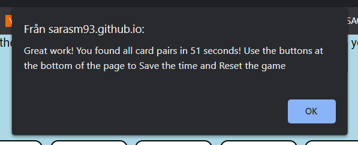

# **Traffic Sign Memory**

Traffic Sign Memory is a game that aims to make learning traffic signs easier and more fun! Getting a drivers license is not the easiest of things - there is a lot to remember! And once you have the license you may not use some of the knowledge you gained in the process of getting the lisence in a long time, risking to forget it again. This Traffic Sign Memory game can help prevent this. By playing the game the user's memory is trained in two ways. It is trained to remember the position of the cards with the traffic signs on them, as the position is randomly set by the computor each time the game starts. As a result of this, the user's memory is also trained to better remember traffic signs by having to repeatedly look at them when clicking around to find the matching cards. 

It is targeted towards adults who are in the process of getting a driver's license and adults who already have a driver's license but want to improve their ability to remember road signs. They can use it as an easy and fun way to remember road signs faster and better.

You can find the site [here](https://sarasm93.github.io/traffic-sign-memory/).

## **Features**
***
### **Existing features**

#### *The Header and The Rules Box*

Contains the name of the game - the header - at the very top of the site where the user would expect it to be. The name makes it obvious to the user what type of memory game it is and it is provided in a font that looks like the font used on traffic signs. The rules of and instructions to the game is found directly beneath the header, which is useful to the user so they can start playing almost directly after getting to the site. 

#### *The Game Board*

This section of the site contains the game board which provies the user with all memory cards in order to play the game. The cards are faced down showing a placeholder image of a car. As the site loads, the images of traffic signs are randomly shuffled around by the computor on the sides of the cards that are facing down. Each card is a interactive button that the user can click. When clicked, they flip to face up and show a traffic sign. When two cards have been flipped and the traffic signs don´t match, the cards are automatically unflipped to face down so that this doesn´t have to be done by the user. This is done after almost 1,5 seconds, which is useful to the user as it gives some extra time to register which traffic signs were shown.   

When the user clicks the first button, the time tracker starts (counting seconds). When the user have found all matching pairs of cards the time stops and the user is informed by it with an alert message informing of the time it took to finish the game and how to save and restart the game.This is done so that the user clearly knows that the game was finished.

It is not possible to click a new card before cards that are already faced up and not matching are faced down again, making it easier for the user to keep track on where in the game they are. And the user cannot cheat by clicking on cards that are already matched and faced up to "find" a new match.

The cards turn grey when hovered over, to make it easier for the user to see which card they are about to click.

#### *The Game Results*

This section shows the time tracker, the saved time scores and buttons to save and reset the game. After the game is finished the user can see the time it took to finish at the top of this section. The user can click the red save button and when doing this the latest time score is saved and will be shown below the time tracker to the right. The user is also provided with a best time score to the left, if playing the game several times. This is useful to the user as it adds excitement and makes it more fun to play. On smaller screens the best time score is shown above the latest time score, not beside it. The save and reset button have clear colors to make them stand out from the background and remind the user to save and how to reset.

If the user tries to save a score before finishing the game, an alert message will inform them of this and the user won´t be able to save, which is useful to the user as it prevents cheating and therefore probably faster learning. An alert message will also show if the user tries to save before even starting the game. 

The reset button resets the game, i.e. faces the cards down, shuffles the traffic signs and resets the time tracker, so that the user can play over and over, to really learn the traffic signs. This button can be clicked any time the user wants, which is useful if the user for example was interrupted when playing. If the user forgets to save the score before clicking the reset button when finishing the game, an alert message will show in which the user can choose to be okay with not saving or go back to save before reseting. This is very useful to the user as it prevents loosing good scores. 

### **Future features**

Expansion of the game:
- Add more cards, i.e. traffic signs
- Add game levels with different numbers of cards

## **Testing**
***

The [WebAIM Contrast checker](https://webaim.org/resources/contrastchecker/) has been used to test that the contrast between the colors used is sufficient. The first red color (#ff0000) that I used for the "Save-time"-button didn´t pass one of the tests for normal sized text, but as it passed all other tests I didn´t change it at first. But later, when I saw that this affected the accessibility score in the Lighthouse test, I changed the red color to a deeper one passing all WebAIM Contrast checker tests.

The site has been tested so that it works on different browsers. The game has been played and works on Google Chrome, Microsoft Edge, Firefox and Samsung Internet. I have checked that the game results are always correct and that alert messages shows up as intended. I have also checked that the header, all instruction and alert-message text, results, text on the buttons and the traffic signs images are all readable and easy to understand.   

I have used the [Am I Responsive site](https://ui.dev/amiresponsive) from ui.dev and the DevTools toolbar to make sure the site is responsive and looks good on different standard screen sizes. 

Git was used for version control. Gitpod was used to write the code and the site was continuously preview using DevTools.

### **Validator testing**

I have validated my HTML and CSS code with the below websites.

- HTML: [W3C Markup Validation Service](https://validator.w3.org/#validate_by_input)
- CSS: [W3C CSS Validation Service](https://jigsaw.w3.org/css-validator/#validate_by_input)

Validation of the HTML and CSS code didn´t return any errors or warnings.

[JSHint](https://jshint.com/) was used to detect errors and problems in the Javascript code.

When checking the Javascript code with JSHint there were warnings of unnecessary semicolons on several lines in the code. The semicolons were places after closing `}`. To solve these warnings I simply removed the semicolons that JSHint warned about.

JSHint also sent several warnings like this one: "'let' is available in ES6 (use 'esversion: 6') or Mozilla JS extensions (use moz)" on several lines. To solve these warnings I had to go to the Configure menu at JSHint and check the "New Javascript features (ES6) option. After that, one last warning remained. It warned about a function inside the `for...loop` in the resetGame function that I used to iterate through the `cards` array in order to unflip the cards when the user wants to reset the game. The warning said "Functions declared within loops referencing an outer scoped variable may lead to confusing semantics. (flippedCard, userPlay, boardBlocked)". Seeing this warning I realised the setTimeout function wasn´t needed inside the loop to get the functionality I wanted. So to solve the warning I simply moved the code inside the setTimeout function out of the function and placed it directly inside the loop, and then removed the setTimout function. 

The deployed site returns no errors when validated with JSHint. The following metrics is returned:
- There are 13 functions in this file.
- Function with the largest signature take 2 arguments, while the median is 0.
- Largest function has 29 statements in it, while the median is 4.
- The most complex function has a cyclomatic complexity value of 7 while the median is 1.

I also checked the accessibility of the site with Lighthouse in DevTools. The results for the final site is shown below.
 

When testing the site with Lighthouse the first time, the SEO score was 92 and a message was shown saying the site didn´t have any meta description. I added a meta description and keywords in the head in HTML code and the score increase to 100. 

The first Lighthouse-test also showed an accessibility score of 95 and a message saying the background and foreground colors of the submit button didn´t have a sufficient contrast ratio. To solve this I changed the color (#ff0000) of the button to a deeper red (#b30000), checking with WebAIM Contrast checker to see when it was dark enough to get sufficient contrast against the white text in the button. After this change had been made the accessibility score increased to 100. 

### **Resolved problems**

In the beginning of building the site I had troubles finding a way to randomly shuffle the traffic signs on the cards once when starting the game, and not shuffle the traffic signs on each card each time each card was clicked. I tried using the onclick-method on the `img`-elements. But finally it was solved by using the shuffle function from [Stackoverflow](https://stackoverflow.com/questions/2450954/how-to-randomize-shuffle-a-javascript-array)(see more in the credits section) and a separate function to flip the cards using data-attributes on the `img`-elements to get the image source from the shuffled array of traffic sign image sources.  

The game has a :hover psuedo-class selector placed on the `img`-elements to change the background color when hovering the `img`-elements (cards). The first version of the game also had functions in the javascript code that changed the background color of the `img`-elements when they were clicked (so that the traffic sign images had a different color then the placholder car image). This change in background color was done in javascript beacuse all images used in the game have a "built in" transparent background. However, when building the game and testing it´s functionality I noticed that after the `img`-elements background color was changed with javascript the hover effect didn´t work anymore. As the game works and looks good without changing the background when clicking the cards, I just removed the functions changing the background color in javascript.

I also had troubles getting the message that alerts the user that the time score hasn´t been saved (when clicking the reset button) to show only once, to not force the user to save a score if it doesn´t want to. It was solved by using the `confirm()` method to allow the user to choose what to do directly in the alert message. If the `confirm()` method hadn´t been used the user would of been sent back to the site and then gotten the same alert message again when clicking the reset button.  

### **Bugs**

When playing the game to test functionality I discovered that it was possible to get a match of cards by clicking on the same card twice or clicking on a pair of cards that had already been matched. I noticed that this was due to not removing the click event listener for the first card at the right time in the code (the event listener was removed after the second card was flipped). So to solve this I removed the event listener for the first card *directly* after it has been clicked, by adding `firstCard.removeEventListener("click", userPlay);`. 

When testing the site in Firefox and Microsoft Edge the traffic sign-images didn´t show but the placeholder car-image did. I discovered that the files had different formats; the traffic sign images were .jpg files and the placeholder car image was a .png file. To solve this I just changed the format of the traffic sign-images to .png.

In the first version of the game, the game board had a white background around all the cards (like a white square). But on larger screens the white background didn´t follow where the cards were placed. As the white background was only a design choice and didn´t affect the functionality of the game, I removed it, and then actually thought it made the game look better.

When testing the site with Firefox on a phone the text in the reset button didn´t fit into the button very well; it was written on two lines instead of one. To solve this I made the button a bit wider for smaller screen sizes (320px to 480px) so that the text could fit on one line.

In the deployed version there is a known error in the console showing up each time the browser is refreshed, see image below. This error wasn´t there during almost the whole process of building the site. It is asking for a icon but as this site doesn´t have any icon the error can´t be fixed.

No other bugs have been idenitified in the deployed version.

## **Deployment**
***

You can find the link to the live site [here](https://sarasm93.github.io/traffic-sign-memory/).

The site was deployed to Github Pages with the following three steps:

1. Log on to GitHub
2. Find the correct repository
3. Find the settings tab in the repository navigation bar
4. Find the pages option in the bar on the right hand side
5. In the branch drop-down menu select the main branch
6. Click the save button
7. The site is published and the URL for it is now provided in the bar directly under the GitHub Pages. If the URL is not provided directly you might need to refresh the page in order for it to show.

## **Credits**
***
### **Content and design**

In order to get started with the html code I used the '!+tab' command to create a boilerplate html structure.

I used this [Love Maths lesson](https://learn.codeinstitute.net/courses/course-v1:CodeInstitute+LM101+2021_T1/courseware/2d651bf3f23e48aeb9b9218871912b2e/78f3c10a937c4fe09640c7c0098d16bd/?child=first) to get started with the javascript code. I also used this code (shown in the lesson) for an event listener listening for the DOM content to be loaded: `document.addEventListener("DOMContentLoaded", function () {`. I used this line of code at the very top of my script.js file.

I also used the [Love Running website](LÄNK) and the [Love Maths website](LÄNK) to figure out that setting `width:`, `height:` and `margin: auto` on the game board `div` can be used to align the cards to the center of the screen. 

The code on lines 48-59 in the script.js file is taken from [this Stackoverflow.com page](https://stackoverflow.com/questions/2450954/how-to-randomize-shuffle-a-javascript-array) and used to shuffle the traffic sign image sources in order to show them randomly on the game board.

The function on line 167-169  in the script.js file is taken from [this W3Schools.com page](https://www.w3schools.com/js/tryit.asp?filename=tryjs_array_sort_math_min) and has then been renamed. The function is used to find the lowest value of the variable `let timeArray` which is holding all the saved time scores, i.e. the function is used to find the fastest time in which the user has finished the game.

To better understand how data-attributes work, I used [this W3Schools](https://www.w3schools.com/tags/att_global_data.asp) site to learn more. To better understand timing events in javascript I used [this W3Schools site](https://www.w3schools.com/js/js_timing.asp). [This W3Schools site](https://www.w3schools.com/jsref/met_win_confirm.asp) was used to learn about the confirm-method. To better understand how `event.target` works I used [this website](https://www.educative.io/answers/what-is-eventtarget-in-javascript) to help me.

I used this [google search for memory game](https://www.google.com/search?q=memory+game&rlz=1C1IBEF_svSE1046SE1046&sxsrf=APwXEdceULB4pIF0rDT7QQ1L7FSIh_13PA:1681194978841&source=lnms&tbm=isch&sa=X&ved=2ahUKEwiI3ousm6H-AhVScvEDHe6uAAkQ_AUoAXoECAEQAw&biw=1536&bih=714&dpr=1.25) to get inspiration for the design and layout of the site. I also made a google search for [traffic signs speed limit](https://www.google.com/search?q=traffic+signs+speed+limit&tbm=isch&ved=2ahUKEwizu7ih86H-AhWOwioKHX3iAN4Q2-cCegQIABAA&oq=traffic+signs+speed+limit&gs_lcp=CgNpbWcQAzIECCMQJzIHCAAQgAQQEzIICAAQCBAeEBMyCAgAEAgQHhATUABYAGD44QZoA3AAeACAAViIAaYBkgEBMpgBAKoBC2d3cy13aXotaW1nwAEB&sclient=img&ei=Elw1ZLPqMY6FqwH9xIPwDQ&bih=714&biw=1536&rlz=1C1IBEF_svSE1046SE1046 ) trying to find what font is typically used on traffic signs, and then tried to find that font on [Google Fonts](https://fonts.google.com/).

[Google Fonts](https://fonts.google.com/) was used to import 'Barlow Semi Condensed' and 'Roboto' fonts.

The readme.md files for the [Love Maths website](https://github.com/Code-Institute-Solutions/readme-love-maths/blob/master/README.md) and the [ULTIMATE Rock Paper Scissors website](https://learn.codeinstitute.net/courses/course-v1:CodeInstitute+JSE_PAGPPF+2021_Q2/courseware/30137de05cd847d1a6b6d2c7338c4655/c3bd296fe9d643af86e76e830e1470dd/) has been used as inspiration for the content of the readme.md file for this site.

### **Images**

The images of the traffic signs and the placeholder car image showed before cards are flipped to face up is taken from [Pixabay](https://pixabay.com/). The specific links to each image are listed below.

- [placeholder-car.png](https://pixabay.com/vectors/auto-automobile-truck-car-2071876/)
- [bicycle-lane.png](https://pixabay.com/vectors/bicycle-lane-bicycle-cycling-sign-160714/) 
- [blind-alley.png](https://pixabay.com/illustrations/traffic-sign-traffic-signs-sign-6727/)
- [no-stopping.png](https://pixabay.com/vectors/no-stopping-traffic-sign-sign-160697/)
- [slippery-road.png](https://pixabay.com/vectors/traffic-sign-sign-slippery-road-160656/)
- [stop.png](https://pixabay.com/illustrations/traffic-sign-traffic-signs-sign-6627/)
- [road-narrows.png](https://pixabay.com/vectors/road-narrows-on-both-sides-160655/)
- [priority-road.png](https://pixabay.com/vectors/priority-road-traffic-sign-sign-160677/)
- [quayside-warning.png](https://pixabay.com/vectors/triangle-warning-sign-traffic-sign-30522/)
- [motorway.png](https://pixabay.com/illustrations/traffic-sign-traffic-signs-sign-6720/)
- [no-overtake.png](https://pixabay.com/vectors/no-overtaking-by-lorries-traffic-sign-160692/)

[Tinypng](https://tinypng.com/) was used to compress the images.

## **Acknowledgements**
***
I want to thank my mentor Antonio Rodriguez for guiding me when building this site, for example helping with the use of data attributes and shuffling, how to track time and to create options in alert message.
